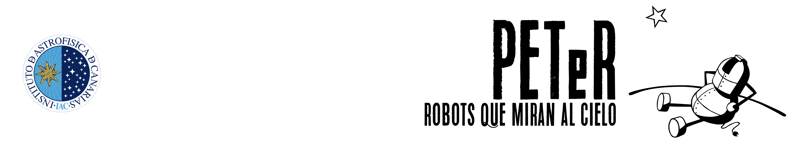

# Apuntes_Peter
Apuntes Webinar: [Peter. Robots que miran al cielo.](https://www.iac.es/peter/) Instituto Astrofisica de Canarias ([@IAC_Astrofisica](https://twitter.com/IAC_Astrofisica)). Ponente: [Nayra Rodríquez](https://www.iac.es/peter/profile/nayra/).

Entre los tres mejores lugares para observar el cielo, hay uno es nuestro pais, en concreto en Canarias. Ahí están ubicados dos de los observatorios más importentes de nuestro planeta:
- Observatorio del Teide en Tenerife.
- Observatorio del Roque lo de los Muchachos en La Palma.

# PETeR

Proyecto Educativo con Telescopios Robóticos
• > 200 centros educativos,(primaria, secundaria, FP, mayores), escuelas no formales, clubs de ciencia, ...
• 20 asociaciones de astrónomos aficionados.

## Objetivos

 Acercar la Astronomía a estudiantes y a la sociedad a través de su participación en investigaciones científicas reales.

 Incentivar las vocaciones científico- tecnológicas y el interés por la ciencia.

 Formar a profesorado en temas de Astronomía y en métodos de aprendizaje basado en la investigación.

## ¿Por qué Telescopios Robóticos?

 **AUTÓNOMOS** No necesitan la precesencia de astrónomos.

 **ACCESIBLES** Se controlan a través de Internet.

 **COLECTIVOS** Muchos observadores pueden usarlos cada noche.

# Los Robots

## [El Telescopio Liverpool](https://www.iac.es/peter/telescopios/el-telescopio-liverpool/)

• Telescopio robóticototalmente autónomo

• Espejo colector: 2 metros

• ORM (La Palma)

• Imagen, espectroscopia, polarimetría

• Visible-infrarrojo

**5% tiempo total (~40 h/semestre) para proyectos educativos/divulgativos en España**

Lo primero que hay que hacer si has pensado desarrollar un proyecto ciéntifico utilizando los Telescopios Robóticos es [REGISTRA TU CENTRO](https://www.iac.es/peter/registra-tu-centro/), aquí debes indicar tu perfil de usuario, profesor/a (primaria o secundaria), aficionado/a u otros. El registro no es inmediato se debe esperar unos días para recibir respueta.

