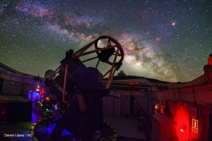
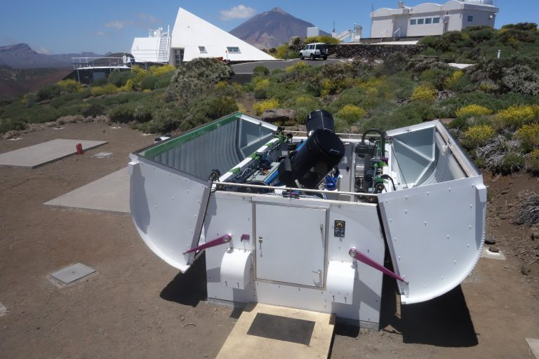
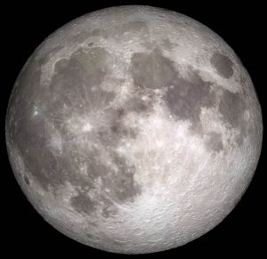
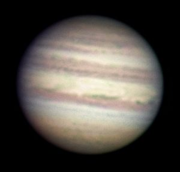
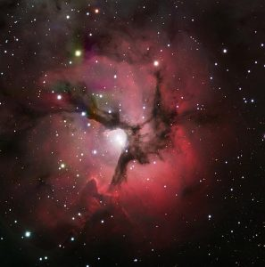
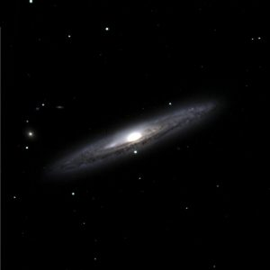

# Apuntes_Peter
Apuntes Webinar: [Peter. Robots que miran al cielo.](https://www.iac.es/peter/) Instituto Astrofisica de Canarias ([@IAC_Astrofisica](https://twitter.com/IAC_Astrofisica)). Ponente: [Nayra Rodríquez](https://www.iac.es/peter/profile/nayra/).

## Contenido

|  | Menú  |
|-------|---------|
|  Sesión 1  | [Cómo observar el Universo con PETeR](https://github.com/profesoratecno/Apuntes_Peter/wiki/Sesi%C3%B3n-1.-C%C3%B3mo-observar-el-Universo-con-PETeR)    |
|  Sesión 2 | [Explora el Sistema Solar con PETeR]()    |
|  Sesión 3 | [Cómo medir el brillo de los objetos celestes]()    |
|  Sesión 4 | [Descubre estrellas variables con PETeR]()          |

# Los Robots

## [El Telescopio Liverpool](https://www.iac.es/peter/telescopios/el-telescopio-liverpool/)

• Telescopio robóticototalmente autónomo

• Espejo colector: 2 metros

• ORM (La Palma)

• Imagen, espectroscopia, polarimetría

• Visible-infrarrojo

*5% tiempo total (~40 h/semestre) para proyectos educativos/divulgativos en España*

## [Red de Telescopios. Las Cumbres](https://www.iac.es/peter/telescopios/observatorio-las-cumbres/)

• Dos telescopios de 40 cm en el Observatorio del Teide (Tenerife)

• En total: 22 telescopios (0.4, 1.0, 2.0 metros)

*Socio educativo: 20 - 40 horas para PETeR por curso (2018 – 2020). Telescopios de 40 cm en Tenerife, Australia, Sudáfrica, Chile, Texas y Hawái*

# ¿Qué podemos hacer con PETeR?

Obtener nuestras propias imágenes del Universo

|  |  |                    *Nebulosa Trífida (M 20). Crédito: Telescopio Liverpool* |                                  *Galaxia NGC 4216. Crédito: Telescopio Liverpool* |
|---------------------------------|----------------------------|----------------------------------|------------------------------|

 La Luna, los planetas, cúmulos de estrellas, nebulosas, galaxias, ....

# ¿Cómo? Paso a paso

## Paso 1

Lo primero que hay que hacer si has pensado desarrollar un proyecto ciéntifico utilizando los Telescopios Robóticos es [REGISTRA TU CENTRO](https://www.iac.es/peter/registra-tu-centro/). Aquí debes indicar tu perfil de usuario, profesor/a (primaria o secundaria), aficionado/a u otros. El registro no es inmediato se debe esperar unos días para recibir respueta.

## Paso 2

Instalar y descargar [PeterSoft](https://www.iac.es/peter/software/). Es un programa de astronomía muy fácil de manejar por el alumnado. En el enlace se indica cómo se instala en los distintos SO.

